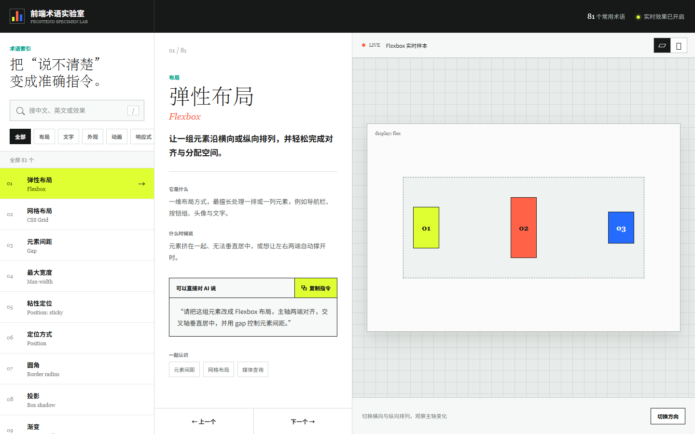

# 前端术语实验室

一个可以边看效果、边学术语的中文前端视觉词典。适合正在使用 AI 编写网页，却不知道该怎样准确描述布局、文字、外观、动画和交互效果的人。

[在线体验](https://soling0410.github.io/frontend-terms-lab/)

## 它能做什么

- **把模糊感觉变成专业术语**：从“这里不太好看”进一步定位到 Flexbox、间距、层级、缓动曲线、滚动显现等具体概念。
- **直接看到真实效果**：每个术语都配有可操作的界面样本，不需要只靠文字想象。
- **生成更准确的 AI 指令**：每个词条提供一段可以直接复制给 AI 的修改描述。
- **感受真实动效**：动画样本会自动演示，也可以暂停或重新播放。
- **同时支持电脑和手机**：桌面端适合集中浏览，手机端提供清晰的分类入口和触控布局。

## 词库规模

目前收录 **140 个前端术语**，覆盖 12 个内容分类：

| 分类 | 数量 | 包含内容 |
| --- | ---: | --- |
| 基础 | 5 | Frontend、Component、State、HTML、DOM |
| 表单 | 15 | Button、Input、Select、Upload、Form 等 |
| 内容展示 | 16 | Table、Card、Timeline、Chart、Chat UI 等 |
| 反馈 | 8 | Alert、Progress、Spinner、Empty State 等 |
| 导航 | 7 | Menu、Breadcrumb、Pagination、Steps 等 |
| 官网区块 | 8 | Hero、CTA、Header、Pricing、FAQ 等 |
| 布局 | 14 | Flexbox、Grid、Gap、Position、Box Model 等 |
| 文字 | 13 | 字号、行高、字间距、省略、可变字体等 |
| 外观 | 17 | 圆角、投影、滤镜、蒙版、主题等 |
| 动画 | 17 | 缓动、错峰、弹簧、视差、滚动显现、转场等 |
| 响应式 | 10 | 媒体查询、容器查询、流体网格、安全区域等 |
| 交互 | 10 | Modal、Drawer、Tabs、Toggle、Tooltip 等 |

## 怎么使用

1. 从分类中选择想了解的方向，或直接搜索中文名、英文名和效果描述。
2. 阅读术语解释，并在实时样本中点击、拖动或等待自动演示。
3. 复制页面提供的 AI 修改指令，粘贴到常用的 AI 编程工具中继续调整网页。

## 适合谁

- 正在用 AI 制作网页，但不熟悉前端术语的人
- 希望快速补齐 UI、CSS、响应式和动效知识的设计或内容创作者
- 需要通过真实样本向同事、客户或 AI 表达界面效果的人
- 想建立前端视觉词汇表的初学者

## 本地打开

这是一个不依赖框架和数据库的静态网页。下载项目后，可以直接打开 index.html；也可以使用任意静态文件服务器运行。

项目由原生 HTML、CSS 和 JavaScript 构成，所有术语数据、交互样本和响应式布局都包含在仓库中。